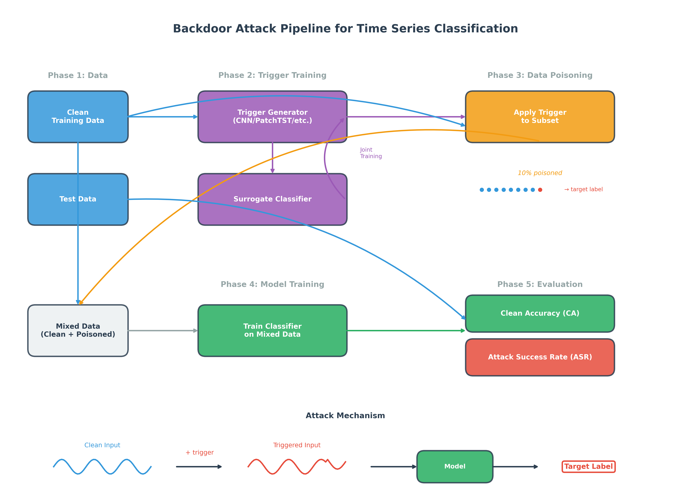

# Analyzing Backdoor attacks on time-series classification

This repo is designed to analyze backdoor attacks on  time-series classification task through implementing various dynamic trigger generation models and backdor insertion frameworks.

References for Time-Series Backdoors :

- [Backdoor Attacks on Time Series: A Generative Approach](https://arxiv.org/abs/2211.07915)
- [Robust Multivariate Time-Series Forecasting: Adversarial Attacks and Defense Mechanisms](https://openreview.net/forum?id=ctmLBs8lITa)
- [Revisiting Backdoor Attacks on Time Series Classification in the Frequency Domain](https://dl.acm.org/doi/abs/10.1145/3696410.3714827)

References for dynamic backdoor mechanisms:
- [Marksman Backdoor: Backdoor Attacks with Arbitrary Target Class](https://arxiv.org/abs/2210.09194)
- [Input-Aware Dynamic Backdoor Attack](https://arxiv.org/abs/2010.08138)
- [Invisible Backdoor Attack with Sample-Specific Triggers](https://openaccess.thecvf.com/content/ICCV2021/papers/Li_Invisible_Backdoor_Attack_With_Sample-Specific_Triggers_ICCV_2021_paper.pdf)

References for time series models:
- [A TIME SERIES IS WORTH 64 WORDS: LONG-TERM FORECASTING WITH TRANSFORMERS](https://arxiv.org/pdf/2211.14730)
- [TIMESNET: TEMPORAL 2D-VARIATION MODELING FOR GENERAL TIME SERIES ANALYSIS](https://arxiv.org/pdf/2210.02186)
- [TimeMixer++: A General Time Series Pattern Machine for Universal Predictive Analysis](https://arxiv.org/abs/2410.16032)
- [iTransformer: Inverted Transformers Are Effective for Time Series Forecasting](https://arxiv.org/abs/2310.06625)
- [MODERNTCN: A MODERN PURE CONVOLUTION STRUCTURE FOR GENERAL TIME SERIES ANALYSIS](https://openreview.net/pdf?id=vpJMJerXHU)
- [TimeMixer: Decomposable Multiscale Mixing for Time Series Forecasting](https://arxiv.org/abs/2405.14616)

References for backdoor defence models:
- [STRIP: A Defence Against Trojan Attacks on Deep Neural Networks](https://arxiv.org/abs/1902.06531)


## Key terms

| Term | Explanation |
|------|--------------|
| Trigger model | NN architecture used to generate trigger pattern|
| Target model | NN architecture targeted and tested for the backdoor insertion|
| Surrogate model | NN architecture used as a target classifier during the training of the trigger model|
| Clean accuracy | |
| Attack success rate | |

## What this repository does
- Loads UEA-format time-series datasets (default: UWaveGestureLibrary) and builds data loaders with padding masks.
- Trains baseline (clean) classifiers.
- Injects backdoors via learned trigger network (`--Tmodel` choices for dynamic triggers).
- Trains a surrogate + trigger pair to craft effective triggers (trigger training phase), then poisons data, then trains the victim model on poisoned data (model poisoning phase).
- Evaluates both utility (clean accuracy) and attack success rate (ASR) and saves plots for metrics and sample traces comparing clean vs triggered inputs.
- Logs every run with arguments, final metrics, curves, and example plots under `Results/` (manifest included).

## Quick start

```bash
# Install
pip install -r requirements.txt

# Clean training (TimesNet)
python main.py --mode clean --model TimesNet --train_epochs 20

# Basic patch backdoor
python main.py --mode basic --model TimesNet --bd_train_epochs 20 --target_label 0 --poisoning_ratio 0.1 --clip_ratio 0.15

# Trigger-based backdoor with surrogate/trigger training
python main.py --mode basic --Tmodel cnn --bd_train_epochs 20 --target_label 0 --poisoning_ratio 0.1 --surrogate_type timesnet --trigger_epochs 5
```

Outputs land in `Results/<dataset>_G-<trigger>_C-<model>_<hash>/` with:
- `args_and_results.txt`: run hash, timestamp, all args, final CA/ASR
- `trigger_loss.png`, `trigger_accuracy.png`: curves for trigger+surrogate training (if used)
- `poison_metrics.png`: CA/ASR across poisoning epochs
- `examples/`: overlay plots of clean vs triggered signals (success/failure) plus `example_plots.txt` manifest with counts and paths
- `latent/`: Shows latent seperability via PCA on the training set. [More infos](https://openreview.net/forum?id=_wSHsgrVali), [Code refence](https://github.com/Unispac/Circumventing-Backdoor-Defenses/blob/master/visualize.py)

## How the pipeline works



1) **Data**: `data_provider/` builds train/test splits with padding masks for variable-length series.
2) **Clean train (optional)**: `clean_train_epoch` / `clean_test_epoch` in `epoch.py` train a clean classifier.
3) **Trigger training (optional)**: `trigger_train_epoch` trains a trigger generator + surrogate classifier to maximize ASR while keeping surrogate clean accuracy.
4) **Poisoning**: `poison_data` applies either a basic patch or a learned trigger to a fraction of training samples, relabeling them to the target label.
5) **Model poisoning**: `poison_model` trains the victim classifier on the poisoned set.
6) **Evaluation**: `bd_test_with_samples` computes loss, clean accuracy, ASR, and collects example traces. `log_all` saves metrics/plots/manifests.

## Key scripts and entry points
- `main.py`: orchestrates clean training or backdoor pipeline (trigger training → data poisoning → model poisoning → logging).
- `scripts/train_clean.sh`, `scripts/train_backdoor.sh`: shell shortcuts for common runs.
- `epoch.py`: core training/eval loops (clean, backdoor, trigger training, bd_test_with_samples for plotting samples).
- `utils/logging.py`: unified logging, plotting, and manifest creation.
- `utils/plot.py`: overlays clean vs triggered inputs and saves success/failure examples.

## Important arguments (see `parameters.py` for full list)
- `--mode`: `clean`, `basic` (single loss concurent update for T and C), `dynamic` (placeholder for advanced trigger training apporaches.)
- `--model`: `TimesNet`, `LSTM`, `PatchTST`, `iTransformer`, `TimeMixer`
- `--Tmodel`: trigger net choice (`cnn`, `timesnet`, `patchtst`, `itst`) for backdoor mode
- `--bd_train_epochs`, `--train_epochs`: poisoning vs clean training epochs
- `--target_label`: label the backdoor forces
- `--poisoning_ratio`: fraction of training samples to poison
- `--clip_ratio`: magnitude for basic patch trigger
- `--surrogate_type`, `--trigger_epochs`, `--warmup_epochs`, `--surrogate_lr`: surrogate/trigger training knobs
- `--batch_size`, `--lr`, `--gpu_id`, `--root_path`: standard training settings

## Project structure (abridged)
```
TimeSeries-Backdoor/
├── data_provider/      # Data loading and collation
├── dataset/            # UWaveGestureLibrary sample dataset
├── layers/             # Building blocks for models
├── models/             # Target and trigger architectures
├── utils/              # logging, plotting, masking, tools
├── scripts/            # helper shell scripts
├── results/            # run outputs (created per run)
├── epoch.py            # train/test loops and bd helpers
├── main.py             # entry point
├── parameters.py       # CLI args
└── README.md
```

## Datasets

| Dataset | Lenght (T) | Numb. of Variable/Channels (N) |
|---------|------------|--------------------------------|


```


